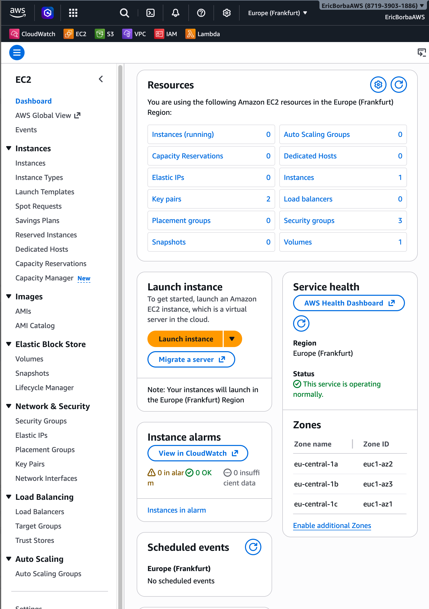
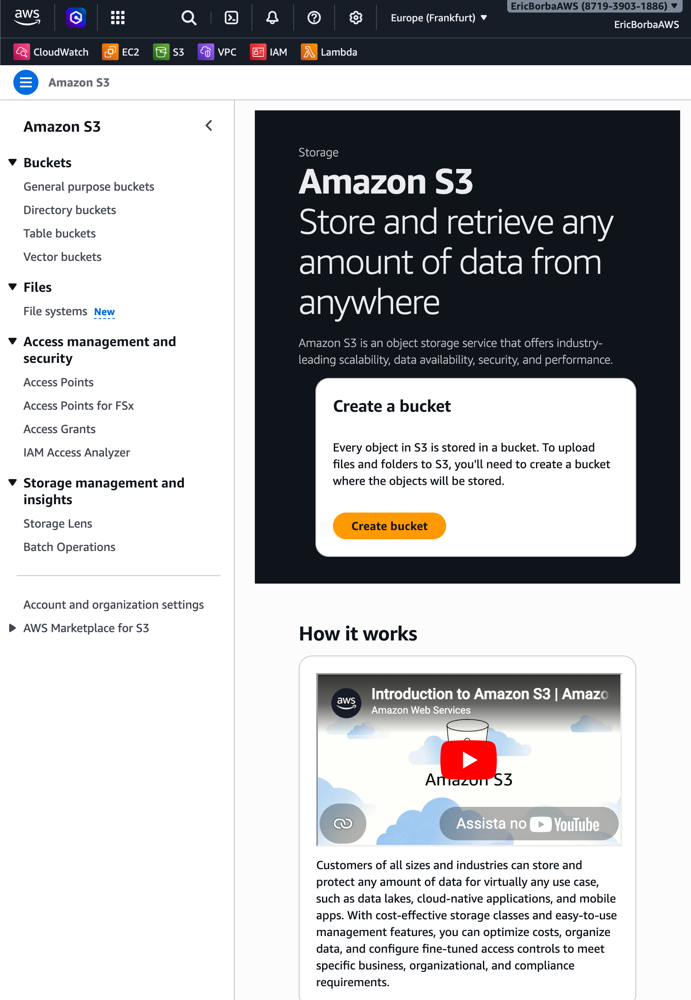
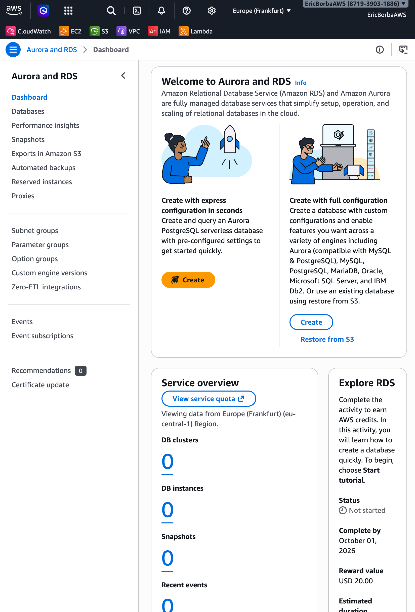
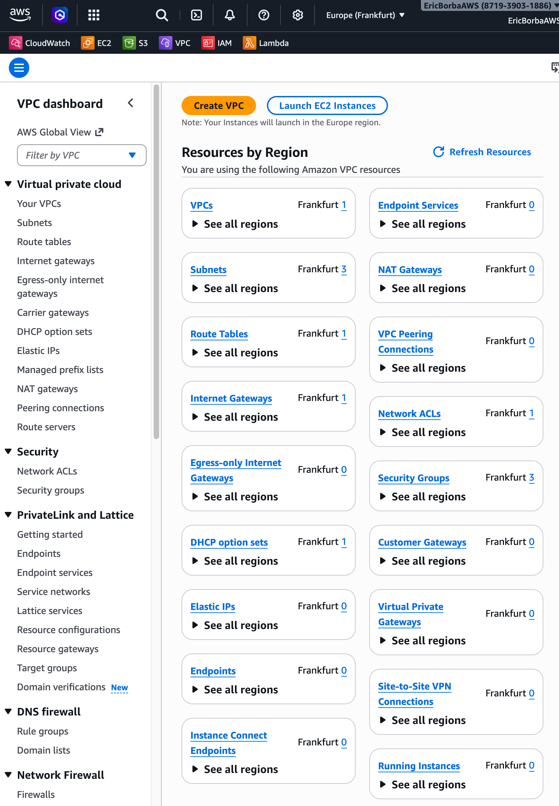
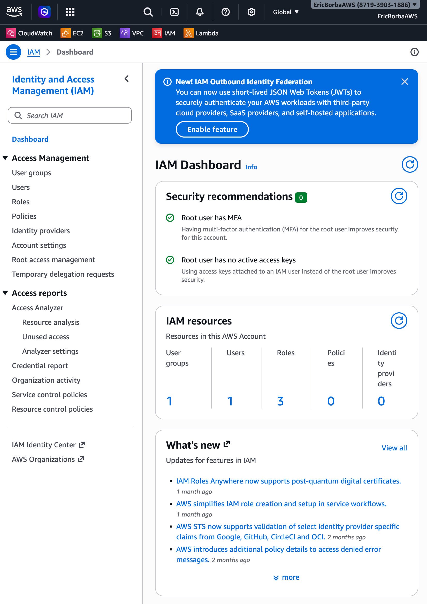
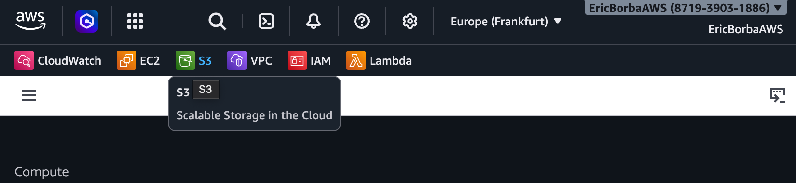
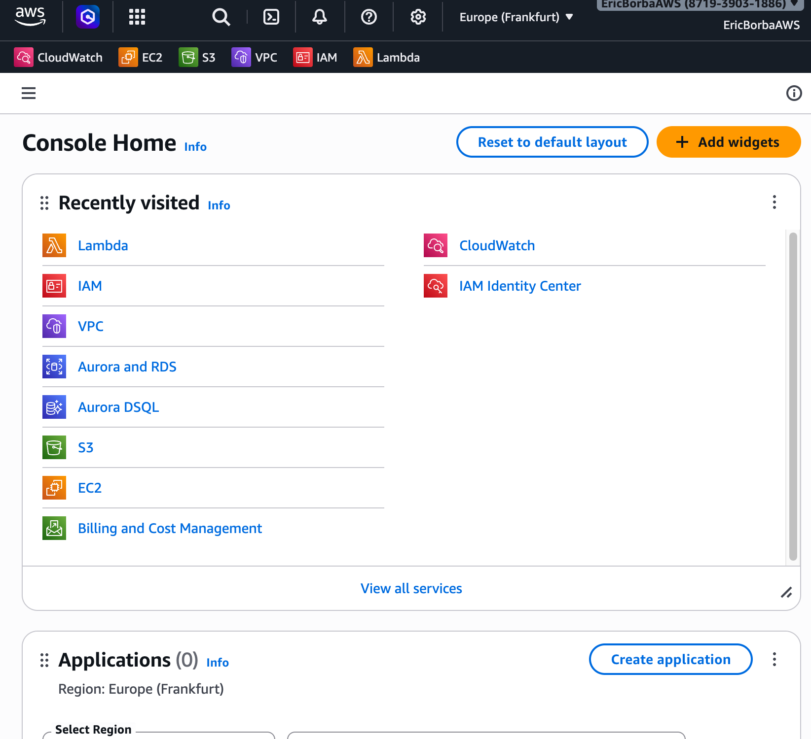
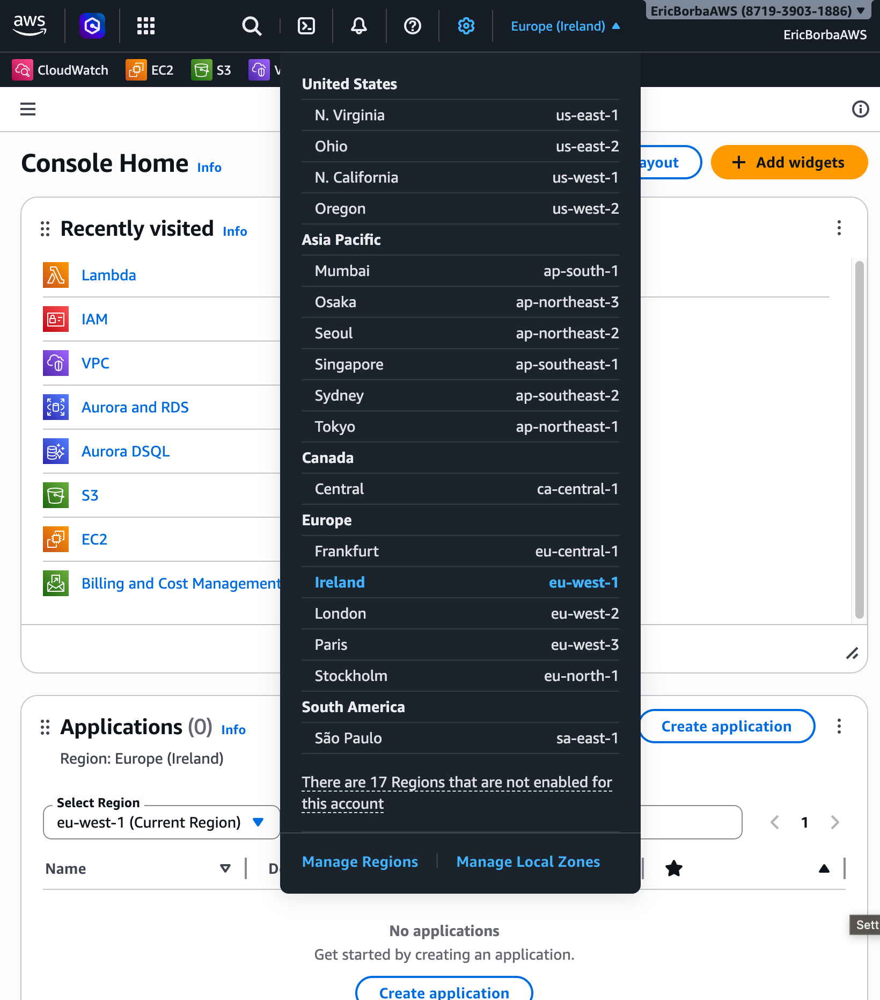
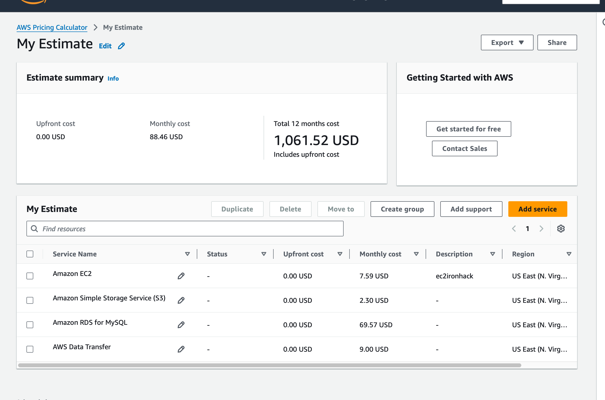

# Exploring AWS Services Lab - Solution

**Student Name:** [Eric Rodrigues Borba]  
**Date Completed:** [20/04/2026]

---

## Exercise 1: Console Navigation

### Part A: Service Discovery

**EC2 (Compute):**
- Purpose: [Run virtual servers to host applications and workloads.]
- Screenshot: 

**S3 (Storage):**
- Purpose: [Store and retrieve files (like images, backups, and documents) in the cloud.]
- Screenshot: 

**RDS (Database):**
- Purpose: [Run and manage relational databases without handling server setup.]
- Screenshot: 

**VPC (Networking):**
- Purpose: [Create a private network in AWS to securely control traffic between resources.]
- Screenshot: 

**IAM (Security):**
- Purpose: [Manage users, roles, and permissions to control access to AWS resources.]
- Screenshot: 

### Part B: Console Features

**Lambda Category:** [Computing]

**Pinned Services:**


**Recently Visited:**


**Region Selector:**

- Original region: [Frankfurt eu-central-1]
- Changed to: [Ireland eu-west-1]
- Changed back: [Yes]

---

## Exercise 2: Service Categorization

### Completed Service Matrix:

| Category | Services | Primary Use Case |
|----------|----------|------------------|
| Compute | [EC2, Lambda, ECS/EKS, Elastic Beanstalk] | [Running applications (VMs, serverless, containers, PaaS)] |
| Storage | [S3, EBS, EFS, S3 Glacier] | [Object, block, file, and archival storage] |
| Database | [RDS, DynamoDB, ElastiCache, Aurora] | [Managed relational, NoSQL, and in-memory databases] |
| Networking | [VPC, CloudFront, Route 53, ELB/ALB/NLB] | [Networking, DNS, content delivery, load balancing] |
| Security | [IAM, KMS, Secrets Manager, AWS Shield] | [Identity, encryption, secret storage, DDoS protection] |
| Management | [CloudWatch, CloudFormation, AWS Config, Systems Manager, CloudTrail] | [Monitoring, infrastructure as code, auditing, automation] |

### Research Question Answers:

**1. What's the difference between EC2 and Lambda?**

[EC2 is a virtual server that runs 24/7 — you manage it, you pay for it always. Lambda is a function that runs only when called and shuts down after.]

---

**2. When would you use S3 vs EBS?**

[S3 is for storing files you want to access from anywhere (images, backups, logs). EBS is a hard drive attached to one EC2 instance]

---

**3. What's the difference between RDS and DynamoDB?**

[RDS is a traditional SQL database (think MySQL/Postgres) — structured tables, relationships. DynamoDB is NoSQL — super fast, infinitely scalable, but schema-less. Use RDS when relationships matter, DynamoDB when speed & scale matter.]

---

**4. Why do you need a VPC?**

[It's your private network inside AWS. Without it, your servers are exposed to the public internet. VPC lets you control who talks to what.]

---

**5. What does CloudWatch monitor?**

[Everything — CPU usage, memory, logs, API calls, error rates, custom metrics. It's AWS's eyes and ears. You set alarms, and it tells you when something's wrong.]

---

## Exercise 3: AWS CLI

### CLI Version:
```
[aws-cli/2.34.21 Python/3.14.3 Darwin/22.3.0 source/arm64]
```

### Configuration:
```
[NAME       : VALUE                    : TYPE             : LOCATION
profile    : <not set>                : None             : None
access_key : ****************MI22     : shared-credentials-file : 
secret_key : ****************87Dg     : shared-credentials-file : 
region     : eu-central-1             : config-file      : ~/.aws/config]
```

### CLI Outputs:

See attached `cli-outputs.txt` file for all command outputs.

**Key findings:**
- My AWS Account ID: [871939031886]
- Default region: [eu-central-1]
- Number of regions available: [17]

---

## Exercise 4: Pricing Research

### Pricing Worksheet:

**1. EC2 t3.micro (Linux, us-east-1):**
- On-Demand: $0.0104 per hour
- Monthly (730 hours): $7.59
- Free Tier eligible: [Yes]
- Free Tier details: [750 hours/month free]

**2. S3 Standard Storage:**
- 100 GB monthly cost: $2.30
- Free Tier: First 5 GB free for 12 months
- Cost per GB: $0.023

**3. RDS db.t3.micro (MySQL):**
- Monthly cost: $24.82
- Storage (20 GB): $ Free (750 hours/month)
- Total: $~$12.41 - $21.90 (after free tier)
- Free Tier eligible: [Yes]

**4. Data Transfer OUT:**
- 100 GB cost: $ Free
- First 100 GB free per month
- After free tier: ~$0.09 per GB (100GB = $9.00) Data transfer to Internet

### AWS Pricing Calculator Estimate:



**Estimate Link:** [https://calculator.aws/#/estimate?id=c5fe67f5083761d8d9a5780f980f48a7ea9a7fe5]

**Total Estimated Monthly Cost:** $88.46 ($0.00 Upfront Cost)

---

## Exercise 5: Documentation Hunt

### EC2 Instance Types:
- Documentation URL: [https://docs.aws.amazon.com/ec2/]
- t3.medium vCPUs: 2
- t3.medium memory: 4 GB

### S3 Storage Classes:
- Documentation URL: [https://docs.aws.amazon.com/s3/]
- All storage classes:
  1. [S3 Standard]
  2. [S3 Intelligent-Tiering]
  3. [S3 Standard-IA]
  4. [S3 One Zone-IA]
  5. [S3 Glacier Instant Retrieval]
  6. [S3 Glacier Flexible Retrieval]
  7. [S3 Glacier Deep Archive]
  8. [S3 Express One Zone]
- Cheapest for archive: [S3 Glacier Deep Archive]

### IAM Best Practices:
- Documentation URL: [https://docs.aws.amazon.com/iam/]
- Three best practices:
  1. [Use IAM roles instead of long-term access keys]
  2. [Apply least privilege permissions]
  3. [Enable multi-factor authentication (MFA)]

### Free Tier Limits:
- Documentation URL: [https://aws.amazon.com/free/]
- EC2 t2.micro hours/month: 750
- S3 storage free: 5 GB

---

## Exercise 6: Regions and Availability Zones

### Your Current Region:
- Region Name: [Frankfurt]
- Region Code: [eu-central-1]
- Number of AZs: 3 (aws ec2 describe-availability-zones --region eu-central-1 --query 'length(AvailabilityZones)' --output text)

### Concept Questions:

**What is the difference between a Region and an Availability Zone?**

[A Region is a geographic location like "US East" or "Europe West." Inside each Region there are multiple Availability Zones, which are basically separate physical data centers. Region is the big picture, AZ is the building.]

---

**Why does AWS have multiple regions?**

[So your app can be closer to your users, comply with local data laws, and stay alive even if one part of the world has an outage.]

---

**How many Availability Zones does each region typically have?**

[Usually 3, sometimes more. Rarely less.]

---

**Can you deploy resources in multiple regions simultaneously?**

[Yes, and it's actually encouraged for critical apps. More regions means more resilience and better global coverage.]

---

### Region Selection Analysis:

| Scenario | Best Region | Reasoning |
|----------|-------------|-----------|
| Serving users primarily in Europe | [eu-central-1] | [Centrally located in Europe, low latency for EU users] |
| Lowest cost for non-critical workloads | [us-east-1] | [Typically the cheapest AWS region with the lowest pricing across many services] |
| GDPR compliance required | [eu-central-1] | [Data stays within the EU, helping meet GDPR] |
| Serving users in Asia-Pacific | [ap-southeast-1] | [Well-connected regional hub with good latency across Southeast Asia] |
| Need newest AWS services | [regius-east-1] | [AWS usually launches new services and features here first before other regions] |

---

## Bonus Challenges

### Challenge 1: Cost Estimate

**Architecture:**
- 1x t3.medium EC2 (24/7)
- 1x db.t3.micro RDS (24/7)
- 50 GB S3
- 100 GB data transfer

**Estimated Monthly Cost:** $116.99

**Calculator Link:** [https://calculator.aws/#/estimate?id=86ccfd6532110d0d3f8948863d5590f8a052fc31]

---

### Challenge 2: Service Comparison

| AWS | Azure | GCP |
|-----|-------|-----|
| EC2 | [Virtual Machines (Azure VMs)] | [Compute Engine] |
| S3 | [Blob Storage] | [Cloud Storage] |
| RDS | [Azure SQL Database / Azure Database for PostgreSQL/MySQL] | [Cloud SQL] |
| Lambda | [Azure Functions] | [Cloud Functions] |

---

### Challenge 3: CLI Advanced

$ aws service-quotas list-service-quotas --service-code ec2 --query 'Quotas[?contains(QuotaName, `Running On-Demand`)]'

[
    {
        "ServiceCode": "ec2",
        "ServiceName": "Amazon Elastic Compute Cloud (Amazon EC2)",
        "QuotaArn": "arn:aws:servicequotas:eu-central-1:871939031886:ec2/L-43DA4232",
        "QuotaCode": "L-43DA4232",
        "QuotaName": "Running On-Demand High Memory instances",
        "Value": 0.0,
        "Unit": "None",
        "Adjustable": true,
        "GlobalQuota": false,
        "UsageMetric": {
            "MetricNamespace": "AWS/Usage",
            "MetricName": "ResourceCount",
            "MetricDimensions": {
                "Class": "HighMem/OnDemand",
                "Resource": "vCPU",
                "Service": "EC2",
                "Type": "Resource"
            },
            "MetricStatisticRecommendation": "Maximum"
        },
        "QuotaAppliedAtLevel": "ACCOUNT",
        "Description": "Maximum number of vCPUs assigned to the Running On-Demand High Memory instances."
    },
    {
        "ServiceCode": "ec2",
        "ServiceName": "Amazon Elastic Compute Cloud (Amazon EC2)",
        "QuotaArn": "arn:aws:servicequotas:eu-central-1:871939031886:ec2/L-417A185B",
        "QuotaCode": "L-417A185B",
        "QuotaName": "Running On-Demand P instances",
        "Value": 0.0,

$ aws ec2 describe-instance-types --query 'sort_by(InstanceTypes, &MemoryInfo.SizeInMiB)[*].[InstanceType,MemoryInfo.SizeInMiB]' --output table

-------------------------------------
|       DescribeInstanceTypes       |
+----------------------+------------+
|  t4g.nano            |  512       |
|  t3.nano             |  512       |
|  t3a.nano            |  512       |
|  t2.nano             |  512       |
|  t2.micro            |  1024      |
|  t3.micro            |  1024      |
|  t4g.micro           |  1024      |
|  t3a.micro           |  1024      |
|  c7gd.medium         |  2048      |
|  c8a.medium          |  2048      |
|  c7a.medium          |  2048      |
|  a1.medium           |  2048      |
|  t3a.small           |  2048      |
|  c6gn.medium         |  2048      |
|  c8gd.medium         |  2048      |
|  t4g.small           |  2048      |
|  c7g.medium          |  2048      |
|  c8g.medium          |  2048      |
|  c6gd.medium         |  2048      |
|  t3.small            |  2048      |
|  c8gn.medium         |  2048      |
|  t2.small            |  2048      |
|  c6g.medium          |  2048      |
|  c3.large            |  3840      |
|  c4.large            |  3840      |
|  m3.medium           |  3840      |
|  m8a.medium          |  4096      |
|  c6i.large           |  4096      |
|  m6gd.medium         |  4096      |

$ aws ec2 describe-availability-zones --region eu-central-1 --query 'length(AvailabilityZones)' --output text

[3]

---

## Reflection

**What surprised you most about AWS services?**

[How well everything fits together. When configured right, you can have solid security, great performance, and full cost control, all at once. It's more manageable than it looks at first glance.]

---

**Which AWS service are you most excited to learn about?**

[Everything around AI workloads — deploying models, monitoring them, and keeping costs under control. That intersection of AI and cloud feels like where things are really heading.]

---

**How comfortable do you feel navigating the AWS Console now?**

[6/10. It's starting to make sense and I can find my way around. But there are a lot of services, and I know I've barely scratched the surface. Comfortable enough to explore, humble enough to know there's a long way to go.]

---

## Checklist

- [x] All service dashboards visited and documented
- [x] All CLI commands executed successfully
- [x] All pricing research completed
- [x] All documentation URLs found
- [x] Region analysis completed
- [x] All screenshots captured
- [x] All questions answered
- [x] Work committed to Git
- [x] Pull request created

---

**Completed By:** [Eric Rodrigues Borba]  
**Date:** [20/04/2026]
